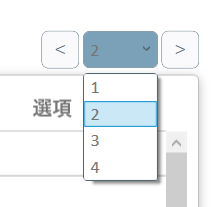
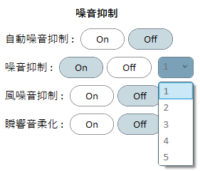
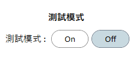

[v2.7.0]
--------
New:
- 用戶搜尋修改為元健雲端實作
- 取消用戶列表一次完整抓取下來，改為分頁方式顯示，以降低伺服器負載
- 在用戶列表上加入分頁切換UI

Known Issue:
- 細節調整尚未實作上傳至元健雲端
- 在試聽或寫入時，有低機率會寫入失敗
- 無法使用自動連線功能
- 連線Onsemi裝置後，點擊"儲存並繼續"後，程式會有凍結的狀況(最長可能持續50秒)
- 尚未實作Onsemi耳機斷線後重連的方法，斷線後建議重開程式再連線
- Onsemi耳機斷線後(如:耳機放入充電盒中)，會有機率造成程式Crash的狀況
- Fitting Table的參數對應尚未完成
	- MPO : 對應Modeler數值(修改不會改變耳機數值)
	- Level 50: 無對應Onsemi的參數 (修改不會改變耳機數值)
	- Level 65: 對應LowLevelGain參數
	- Level 90: 對應HighLevelGain參數
- 尚未實作增益控制項的Bar移動調整WDRC的功能
- 無法正確從元健雲端抓取Fitting Table資料
- 上傳至元健雲端FittingTable的Device_id暫時為goodHearing R1(尚未有goHearing EI1/goHearing EB1的device_id) 

[v2.6.0]
--------
New:
- 加入用戶列表搜尋功能
- 加入用戶列表的適配日期顯示

Known Issue:
- 細節調整尚未實作上傳至元健雲端
- 在試聽或寫入時，有低機率會寫入失敗
- 無法使用自動連線功能
- 連線Onsemi裝置後，點擊"儲存並繼續"後，程式會有凍結的狀況(最長可能持續50秒)
- 尚未實作Onsemi耳機斷線後重連的方法，斷線後建議重開程式再連線
- Onsemi耳機斷線後(如:耳機放入充電盒中)，會有機率造成程式Crash的狀況
- Fitting Table的參數對應尚未完成
	- MPO : 對應Modeler數值(修改不會改變耳機數值)
	- Level 50: 無對應Onsemi的參數 (修改不會改變耳機數值)
	- Level 65: 對應LowLevelGain參數
	- Level 90: 對應HighLevelGain參數
- 尚未實作增益控制項的Bar移動調整WDRC的功能
- 無法正確從元健雲端抓取Fitting Table資料
- 上傳至元健雲端FittingTable的Device_id暫時為goodHearing R1(尚未有goHearing EI1/goHearing EB1的device_id) 

[v2.5.0]
--------
New:
- 加入噪音抑制等級調整功能

- 加入測試模式開關

Bugfix:
- 修正讀取雲端聽力圖value為null造成的crash

Known Issue:
- 細節調整尚未實作上傳至元健雲端
- 在試聽或寫入時，有低機率會寫入失敗
- 無法使用自動連線功能
- 連線Onsemi裝置後，點擊"儲存並繼續"後，程式會有凍結的狀況(最長可能持續50秒)
- 尚未實作Onsemi耳機斷線後重連的方法，斷線後建議重開程式再連線
- Onsemi耳機斷線後(如:耳機放入充電盒中)，會有機率造成程式Crash的狀況
- Fitting Table的參數對應尚未完成
	- MPO : 對應Modeler數值(修改不會改變耳機數值)
	- Level 50: 無對應Onsemi的參數 (修改不會改變耳機數值)
	- Level 65: 對應LowLevelGain參數
	- Level 90: 對應HighLevelGain參數
- 尚未實作增益控制項的Bar移動調整WDRC的功能
- 無法正確從元健雲端抓取Fitting Table資料
- 上傳至元健雲端FittingTable的Device_id暫時為goodHearing R1(尚未有goHearing EI1/goHearing EB1的device_id) 

[v2.4.0]
--------
New:
- 修改細節調整中的自動噪音抑制功能

Known Issue:
- 細節調整尚未實作上傳至元健雲端
- 在試聽或寫入時，有低機率會寫入失敗
- 無法使用自動連線功能
- 連線Onsemi裝置後，點擊"儲存並繼續"後，程式會有凍結的狀況(最長可能持續50秒)
- 尚未實作Onsemi耳機斷線後重連的方法，斷線後建議重開程式再連線
- Onsemi耳機斷線後(如:耳機放入充電盒中)，會有機率造成程式Crash的狀況
- Fitting Table的參數對應尚未完成
	- MPO : 對應Modeler數值(修改不會改變耳機數值)
	- Level 50: 無對應Onsemi的參數 (修改不會改變耳機數值)
	- Level 65: 對應LowLevelGain參數
	- Level 90: 對應HighLevelGain參數
- 尚未實作增益控制項的Bar移動調整WDRC的功能
- 無法正確從元健雲端抓取Fitting Table資料
- 上傳至元健雲端FittingTable的Device_id暫時為goodHearing R1(尚未有goHearing EI1/goHearing EB1的device_id)

[v2.3.0]
--------
New:
- 在FittingPage中增加細節調整功能 (目前只支援原睿平台)

Known Issue:
- 細節調整尚未實作上傳至元健雲端
- 在試聽或寫入時，有低機率會寫入失敗
- 無法使用自動連線功能
- 連線Onsemi裝置後，點擊"儲存並繼續"後，程式會有凍結的狀況(最長可能持續50秒)
- 尚未實作Onsemi耳機斷線後重連的方法，斷線後建議重開程式再連線
- Onsemi耳機斷線後(如:耳機放入充電盒中)，會有機率造成程式Crash的狀況
- Fitting Table的參數對應尚未完成
	- MPO : 對應Modeler數值(修改不會改變耳機數值)
	- Level 50: 無對應Onsemi的參數 (修改不會改變耳機數值)
	- Level 65: 對應LowLevelGain參數
	- Level 90: 對應HighLevelGain參數
- 尚未實作增益控制項的Bar移動調整WDRC的功能
- 無法正確從元健雲端抓取Fitting Table資料
- 上傳至元健雲端FittingTable的Device_id暫時為goodHearing R1(尚未有goHearing EI1/goHearing EB1的device_id)

[v2.2.0]
--------
Bugfix:
- 修正新電腦環境不存在C:\ProgramData\conveyFit\Log時，會出現找不到資料夾的錯誤導致程式關閉
- 刪除Database資料夾 (目前版本已不再使用此資料夾)

[v2.1.0]
--------
New:
- 增加ERH3及ERH2的支援 (Bate)
- FittingData的頻率及Level可隨產品不同而改變
- 修改UI細節
- 調整UI顏色對比

Known Issue:
- 無法使用自動連線功能
- 連線Onsemi裝置後，點擊"儲存並繼續"後，程式會有凍結的狀況(最長可能持續50秒)
- 尚未實作Onsemi耳機斷線後重連的方法，斷線後建議重開程式再連線
- Onsemi耳機斷線後(如:耳機放入充電盒中)，會有機率造成程式Crash的狀況
- Fitting Table的參數對應尚未完成
	- MPO : 對應Modeler數值(修改不會改變耳機數值)
	- Level 50: 無對應Onsemi的參數 (修改不會改變耳機數值)
	- Level 65: 對應LowLevelGain參數
	- Level 90: 對應HighLevelGain參數
- 尚未實作增益控制項的Bar移動調整WDRC的功能
- 無法正確從元健雲端抓取Fitting Table資料
- 上傳至元健雲端FittingTable的Device_id暫時為goodHearing R1(尚未有goHearing EI1/goHearing EB1的device_id)
