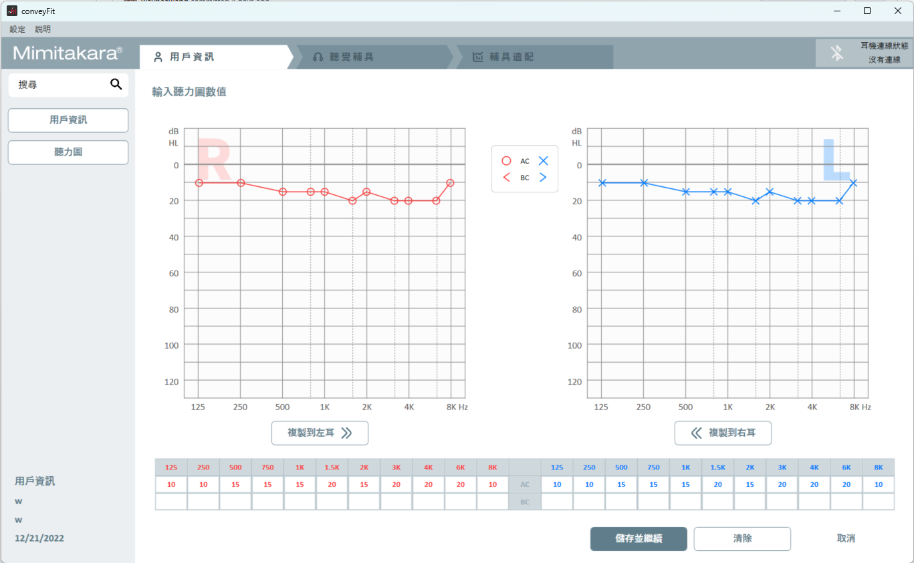

[v2.5.0]
--------
New:
- 加入噪音抑制等級調整功能

- 加入測試模式開關

Bugfix:
- 修正讀取雲端聽力圖value為null造成的crash

Known Issue:
- 細節調整尚未實作上傳至元健雲端
- 在試聽或寫入時，有低機率會寫入失敗
- 無法使用自動連線功能
- 連線Onsemi裝置後，點擊"儲存並繼續"後，程式會有凍結的狀況(最長可能持續50秒)
- 尚未實作Onsemi耳機斷線後重連的方法，斷線後建議重開程式再連線
- Onsemi耳機斷線後(如:耳機放入充電盒中)，會有機率造成程式Crash的狀況
- Fitting Table的參數對應尚未完成
	- MPO : 對應Modeler數值(修改不會改變耳機數值)
	- Level 50: 無對應Onsemi的參數 (修改不會改變耳機數值)
	- Level 65: 對應LowLevelGain參數
	- Level 90: 對應HighLevelGain參數
- 尚未實作增益控制項的Bar移動調整WDRC的功能
- 無法正確從元健雲端抓取Fitting Table資料
- 上傳至元健雲端FittingTable的Device_id暫時為goodHearing R1(尚未有goHearing EI1/goHearing EB1的device_id) 

[v2.4.0]
--------
New:
- 修改細節調整中的自動噪音抑制功能

Known Issue:
- 細節調整尚未實作上傳至元健雲端
- 在試聽或寫入時，有低機率會寫入失敗
- 無法使用自動連線功能
- 連線Onsemi裝置後，點擊"儲存並繼續"後，程式會有凍結的狀況(最長可能持續50秒)
- 尚未實作Onsemi耳機斷線後重連的方法，斷線後建議重開程式再連線
- Onsemi耳機斷線後(如:耳機放入充電盒中)，會有機率造成程式Crash的狀況
- Fitting Table的參數對應尚未完成
	- MPO : 對應Modeler數值(修改不會改變耳機數值)
	- Level 50: 無對應Onsemi的參數 (修改不會改變耳機數值)
	- Level 65: 對應LowLevelGain參數
	- Level 90: 對應HighLevelGain參數
- 尚未實作增益控制項的Bar移動調整WDRC的功能
- 無法正確從元健雲端抓取Fitting Table資料
- 上傳至元健雲端FittingTable的Device_id暫時為goodHearing R1(尚未有goHearing EI1/goHearing EB1的device_id)

[v2.3.0]
--------
New:
- 在FittingPage中增加細節調整功能 (目前只支援原睿平台)

Known Issue:
- 細節調整尚未實作上傳至元健雲端
- 在試聽或寫入時，有低機率會寫入失敗
- 無法使用自動連線功能
- 連線Onsemi裝置後，點擊"儲存並繼續"後，程式會有凍結的狀況(最長可能持續50秒)
- 尚未實作Onsemi耳機斷線後重連的方法，斷線後建議重開程式再連線
- Onsemi耳機斷線後(如:耳機放入充電盒中)，會有機率造成程式Crash的狀況
- Fitting Table的參數對應尚未完成
	- MPO : 對應Modeler數值(修改不會改變耳機數值)
	- Level 50: 無對應Onsemi的參數 (修改不會改變耳機數值)
	- Level 65: 對應LowLevelGain參數
	- Level 90: 對應HighLevelGain參數
- 尚未實作增益控制項的Bar移動調整WDRC的功能
- 無法正確從元健雲端抓取Fitting Table資料
- 上傳至元健雲端FittingTable的Device_id暫時為goodHearing R1(尚未有goHearing EI1/goHearing EB1的device_id)

[v2.2.0]
--------
Bugfix:
- 修正新電腦環境不存在C:\ProgramData\conveyFit\Log時，會出現找不到資料夾的錯誤導致程式關閉
- 刪除Database資料夾 (目前版本已不再使用此資料夾)

[v2.1.0]
--------
New:
- 增加ERH3及ERH2的支援 (Bate)
- FittingData的頻率及Level可隨產品不同而改變
- 修改UI細節
- 調整UI顏色對比

Known Issue:
- 無法使用自動連線功能
- 連線Onsemi裝置後，點擊"儲存並繼續"後，程式會有凍結的狀況(最長可能持續50秒)
- 尚未實作Onsemi耳機斷線後重連的方法，斷線後建議重開程式再連線
- Onsemi耳機斷線後(如:耳機放入充電盒中)，會有機率造成程式Crash的狀況
- Fitting Table的參數對應尚未完成
	- MPO : 對應Modeler數值(修改不會改變耳機數值)
	- Level 50: 無對應Onsemi的參數 (修改不會改變耳機數值)
	- Level 65: 對應LowLevelGain參數
	- Level 90: 對應HighLevelGain參數
- 尚未實作增益控制項的Bar移動調整WDRC的功能
- 無法正確從元健雲端抓取Fitting Table資料
- 上傳至元健雲端FittingTable的Device_id暫時為goodHearing R1(尚未有goHearing EI1/goHearing EB1的device_id)

[v2.0.0]
--------
New:
- 全新版本，串接元健雲端伺服器
- 測試帳號：test@test.test 密碼：123456

[v1.12.0]
--------
New:
- 更新AWToolLIB2.dll版本 (1.0.3.2 -> 1.0.3.3)

[v1.11.1]
--------
Bugfix:
- 修正匯出檔案格式錯誤問題

[v1.11.0]
--------
New:
- 加入goodHearing T1助聽器支援
- 更新AWToolLIB2.dll版本 (0.3.12.5 -> 1.0.3.2)
- 修改MAX MPO (127 -> 160)
Bugfix:
- 修正關閉程式後有機率無法關閉連線Thread

[v1.10.0]
--------
New:
- 加入goodHearing T2助聽器支援
- 更新AWToolLIB2.dll版本 (0.3.12.0 -> 0.3.12.5)

[v1.9.1]
--------
Bugfix:
- 修正讀取耳機電量時，有機率發生Exception導致程式關閉的問題
- 修正在FittingPage點擊聽力圖時，會沒有資料的問題

[v1.9.0]
--------
New:
- 加入自動連線功能
- 現在在選擇客戶之後，能透過上方頁面按鈕跳至不同頁面
- 限制Gain值的上限為 **60**，下限為 **-10**
- 限制MPO值的上限為 **127**，下限為 **32**

[v1.8.3]
--------
New:
- 修改JSON格式
- 新增增益控制項的同步功能

[v1.8.2]
--------
New:
- 預設匯出檔案改為JSON檔
- 修改匯出資料中的software及version
- 增加到微軟說明網頁的超連結

[v1.8.1]
--------
Bugfix:
- 修正在Windows 7以下的作業系統中，點擊超連結至藍牙設定時會出現程式異常結束的問題

[v1.8.0]
--------
New:
- 實作FittingData的大聲音小於中聲音、中聲音小於小聲音，使適配曲線不會交叉
- 新增匯出適配資料的功能。使用方式：
    1. 選擇用戶
	2. 點選上方「匯出 (Export)」，選擇要「輸出到檔案」或「輸出到剪貼簿」

  

	3. 選擇要匯出哪一筆曾「寫入過」的資料

  

Bugfix:
- 修正點選調適記錄後沒有執行試聽的問題

[v1.7.0]
--------
New:
- 修改聽力圖樣式，並可隨視窗大小縮放

  

- 修改調適圖樣式，並可隨視窗大小縮放
- 修改調適頁面中基本面版的樣式:
    1. 將字體些微縮小以符合整體視覺效果
	2. 取消按鈕的底色，改為滑鼠移過去時會出現按鈕
	3. 加大按鈕可點擊區

  

- 修改調適頁面中增益面版的樣式:
    1. SliderBar改為與小聲音的數值同步，拉動時同步改變小、中、大聲音
	2. 修改按鈕樣式，改為左右擺放以節省空間
	3. 當滑鼠停留在SliderBar上時會顯示詳細數值

  

- 現在可以點擊上面Tab回到之前的面頁
- 加入顯示耳機電量功能，電池圖示會依電量分為五種顏色。滑鼠移到電池圖示上時，會顯示詳細電量

  
  

- 修改UI排版，讓程式可支援的最低解析度為1280x720
- 調適時預設改為每操作一步就執行試聽，並預留設定開關

  

- 每次寫入耳機時，會先靜音。待寫入完成後再開啟
- 新增調適時左右耳同步功能

Bugfix:
- 修正寫入Log檔案時有機率讓程式關閉

KnowIssue:
- 同步功能在響度面版還未實裝，會再後續版本加入
- 在點擊讀取調適記錄時，不會執行試聽

[v1.6.0]
--------
New:
- 在FittingPage中加入Loading畫面

  

[v1.5.0]
--------
New:
- 新增(.msi)安裝程式
- 支援單耳連線時也能進行適配
- 讀取/試聽/寫入會依據目前連線狀況執行
- 將適應值分成左右耳
- 在適配紀錄中，增加顯示左耳/右耳/雙耳的狀態
- 讀取寫入紀錄時，只回復對應耳朵的數據
- 藍芽連線狀態更改為顯示左/右耳狀態
- 監聽連線狀態改變時，table的顯示狀態 
- 寫入機器時，紀錄哪一耳被寫入

Bugfix:
- 修正搜尋欄的多國語言問題

[v1.4.0]
--------
New:
- 修改程式圖示
- 在FittingPage實作「基本」頁面
- 在FittingPage實作「增益」頁面
- 將FittingData的頻率分類為 0, 500, 1000, 1500, 2000, 2500, 3000, 3500, 4000, 6000, 8000
- 在FittingPage實作「響度」頁面
- 寫入FittingData時，會記錄在資料庫中
- 新增選擇過去寫入記錄的視窗
- 在FittingPage新增「讀取」按鈕，實作讀取助聽器當前WDRC的設定
- 修改進入FittingPage時，載入FittingData的流程
- 修改FittingPage中「回復」按鈕的功能
- 支援多國語言 (日文、泰文、印尼文)

[v1.3.0]
--------
New:
- 在不關掉程式的情況，當耳機斷線時還能手動重新連線
- 斷線後，還能自動重新連回耳機

Bugfix:
- 寫入WDRC Table後，將回復按鈕取消顯示

[v1.2.0]
--------
New:
- 預設將7000Hz以上的Fitting值除以2
- 在FittingPage中加入對單耳靜音的功能
- 修改FittingPage的參數能夠單獨調整一個音量的曲線
- 修改Database的存放路徑 (C:\ProgramData\FittingTool)
- 在FittingPage中顯示左/右耳的裝置名稱

Bugfix:
- 修正FittingTable寬度不足MPO無法完整顯示的問題
- 修正在FittingTable中輸入空值會導致Tool直接關閉問題

Known Issue:
- [Bug] 在FittingPage做TrialRun時，會出現Handshake Error，並導致操作失敗
	* 在程式碼中有試著做修正，不過改善有限，雖有降低一些發生機率，但還是會可能出現操作失敗
	* 還在等待日月光回覆

[v1.1.0]
--------
- 在FittingPage加入選擇對哪個WDRC Level做調整
- 在FittingPage中加入MPO的設定讓聽力師調整
- 在FittingTable中加入鍵盤上、下方向鍵的支援
- 在FittingPage能夠記錄上一次調整的設定值
- 當滑鼠移到FittingTable時，將對應線圖變粗體
- 在FittingPage中加入查看聽力圖的功能
- 將Fitting的頻率改為WDRC的頻率
- 微調一些UI的設計
- Bug Fix

Known Issue:
- [Bug] 在FittingPage做TrialRun時，會出現Handshake Error，並導致操作失敗
	* 在程式碼中有試著做修正，不過改善有限，雖有降低一些發生機率，但還是會可能出現操作失敗
	* 還在等待日月光回覆

[v1.0.0]
--------
- Release正式版本
